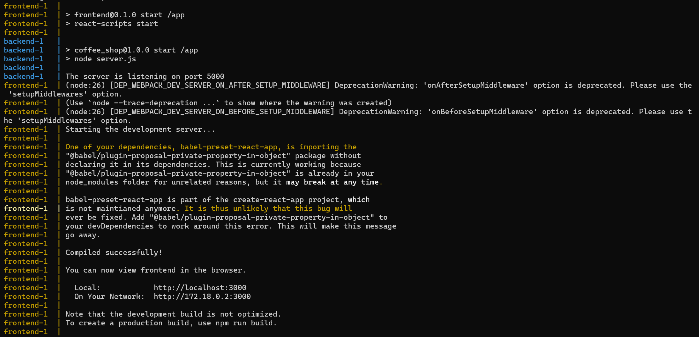
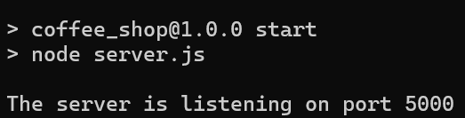
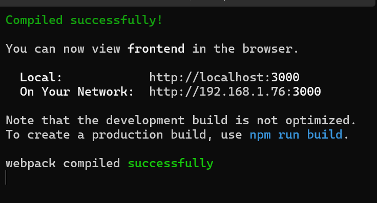

## Overview

All the tasks from the assignment have been implemented, except for _optional_ logo cafe both in backend and frontend.

The technologies used for:
- Backend : 
1. Nodejs 18.x or above
2. Express

- Frontend:
1. React JS
2. React-router
3. Redux
4. Redux Form
5. Aggrid
6. Material-UI


## Clone the Repository
```
git clone https://github.com/83insan/insan-full-stack-cafe.git
```
## General Prerequisites
-	Nodejs on node 18.x or above
(https://nodejs.org/en/download/prebuilt-installer)
-	npm (usually included with Node.js)
-	Git Bash (https://gitforwindows.org/)
-	Postman (https://www.postman.com/downloads/)

## Set up and running via docker
### Pre-requisites
- Docker Desktop (https://www.docker.com/products/docker-desktop/)

### Steps
1. Install `docker desktop` downloaded earlier and restart your PC
2. Open command prompt CLI
3. Navigate to the `root` directory of this project
4. Run the following command:
   ```
   docker-compose up --build
   ```

5. Please wait for it to be completed successfully, and it will be showing the messages from frontend and backend containers as shown below:

   

6. Open any browser and browse to http://localhost:3000. It will load cafes main page based on React framework. 

7. Open `Postman` for testing APIs using the following base URL http://localhost:5000 

## Set up and running via CLI
### Database
#### Pre-requisites
- Sqlite browser (https://sqlitebrowser.org/dl/)

#### Steps
1. Install `Sqlite browser` downloaded earlier
2. Wait for the installation to finish and open Sqlite browser
3. Click on `File` -> `Open Database...`
4. Navigate to the `/backend/db/FreshCafe.db` of this project
5. Double click on it 
6. The database with the existing datas will load

NOTE:
The sql scripts to set up the database from scratch are also provided in `backend/db/sql/` folders:
1. `createTables.sql` to create the database tables (`cafes` and `employees` )
2. `seedDatas.sql` to seed some datas to the tables.

### Backend
#### Steps
1. Open command prompt CLI 
2. Navigate to the `/backend` folder of this project
3. Execute the following command:
   ```
   npm install
   ```

4. After finished installing, execute the following command:
   ```
   npm start
   ```

5. Please wait for it to be completed successfully, and it will be showing:

   

6. After completed, open `Postman` for testing APIs using the following base URL http://localhost:5000 

### Frontend

#### Steps
1. Open command prompt CLI 
2. Navigate to the `/backend` folder of this project
3. Execute the following command:
   ```
   npm install
   ```

4. After finished installing, execute the following command:
   ```
   npm start
   ```

5. Please wait for it to be completed successfully, and it will be showing:

   

6. After completed, it will automatically launch the browser and browse to http://localhost:3000. It will load cafes main page based on React framework. 